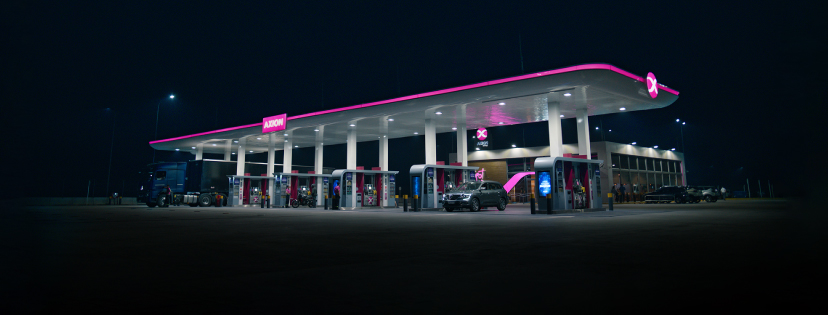

# 🦄 Proyecto Final - Unicorn Academy 2025 | Caso de Estudio
Como trabajo integrador final, se propuso aplicar todos los conocimientos adquiridos en un **caso real de negocio**.

  

## 🏢 Lubricom SRL

**Lubricom SRL** es una empresa familiar ubicada en la ciudad de Formosa, Argentina. Se trata de una **estación de servicio** que ofrece combustible, lubricantes y servicios adicionales.

El objetivo del proyecto fue acompañar a la empresa en su transformación digital, aplicando herramientas de análisis de datos para mejorar la toma de decisiones operativas y estratégicas.

---

## 🎯 Objetivos del Proyecto

1. **Centralizar los datos** de las operaciones diarias en una única fuente confiable.
2. **Diseñar procesos ETL** para automatizar la recopilación, limpieza y carga de datos.
3. **Conectar y analizar los datos** mediante consultas SQL y visualizaciones en Power BI.
4. **Generar tableros interactivos** para monitorear indicadores clave del negocio.
5. **Presentar recomendaciones** basadas en los hallazgos obtenidos a partir del análisis.

---

## 🛠️ Herramientas Utilizadas

| Herramienta    | Uso Principal                            |
|----------------|------------------------------------------|
| Google Sheets  | Recolección de datos y limpieza inicial  |
| MySQL          | Modelado relacional y consultas SQL      |
| Python         | Automatización de procesos ETL           |
| Power BI       | Visualización de datos                   |

---

## 🔄 Proceso de Desarrollo (ETL)

### 🟢 Extracción de Datos

- Se recopiló información desde hojas de cálculo Excel provistas por Lubricom SRL (ventas, productos, clientes, logística).

### 🟡 Transformación

- Se depuraron y normalizaron los datos utilizando Python y funciones avanzadas de Excel.
- Se definieron claves primarias y relaciones lógicas entre tablas.
- Se aplicaron filtros, joins y nuevas columnas calculadas para enriquecer el análisis.

### 🔵 Carga y Visualización

- Los datos fueron cargados en Power BI Desktop.
- Se construyó un dashboard interactivo con múltiples pestañas.
- Se integraron KPIs clave y filtros dinámicos por cliente, zona, familia de productos, entre otros.

---

## 📊 Resultados

El tablero final desarrollado en Power BI permitió transformar hojas de cálculo aisladas en una herramienta estratégica de análisis y toma de decisiones. Entre los principales componentes se incluyen:

### ✅ Indicadores Clave (KPIs)

- **Facturación total**: visualización acumulada y segmentada por mes, zona y familia de productos.
- **Ticket promedio**: comparación entre clientes, zonas y temporalidad.
- **Clientes activos**: monitoreo mensual de la cartera vigente.
- **Productos más vendidos**: ranking dinámico por unidades y por monto facturado.

### 📈 Análisis Dinámico

- **Ventas por zona, producto, cliente y período**: filtros interactivos permiten identificar patrones comerciales y oportunidades de expansión.
- **Tendencias y estacionalidad**: gráficos de líneas y áreas que permiten detectar meses pico y comportamientos cíclicos del consumo.
- **Mapa geográfico de clientes**: representación espacial de la distribución de clientes activos, ayudando a identificar zonas de concentración y potencial crecimiento.

### 💰 Dashboard Financiero Complementario

- Evolución mensual de ventas y cobranzas.
- Comparación entre facturación y cobranzas efectivas.
- Análisis de rentabilidad por familia de productos y clientes.

## 📌 Conclusiones

- **Visión unificada de la información**: por primera vez, Lubricom SRL pudo visualizar sus datos clave de forma integrada, lo cual permite un entendimiento global del negocio.
- **Monitorización en tiempo real**: el dashboard permite tomar decisiones operativas rápidas y basadas en datos, con indicadores actualizables periódicamente.
- **Base para automatización**: se estableció una estructura sólida de ETL que puede evolucionar hacia procesos completamente automatizados.
- **Valorización del análisis de datos**: el proyecto evidenció el potencial del análisis de datos aplicado a PyMEs del sector energético e industrial, sentando precedentes para futuras implementaciones tecnológicas.
- **Aproximación colaborativa**: el trabajo conjunto con el cliente permitió adaptar la solución a las necesidades reales del negocio y fomentar una cultura de toma de decisiones basada en datos.

## 👨‍💻 Equipo de Proyecto

- Camila Pereyra  
- Jazmín M. Altamirano  
- Josefina Marchini  
- Leonardo de Anquín

## 🚀 Reflexión Final

Este proyecto fue una excelente oportunidad para integrar conocimientos técnicos con un caso real de negocio. Pudimos aportar valor a una empresa local mediante herramientas modernas de análisis de datos y, al mismo tiempo, fortalecer nuestras habilidades como analistas.
